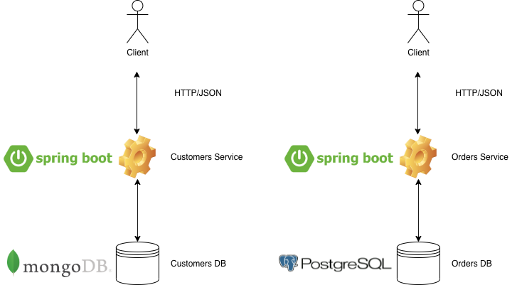

# eCommerce Microservices



## Prerequisites

- Having completed lab [00 - Prerequisites](../00-Prerequisites/README.md)

## Run microservices containers + infrastructure containers (MongoDB, Zookeeper, Kafka, Postgres)

To compile the classes, start microservices containers and infrastructure containers:

```console
$ ./start.sh
```

## Run ONLY infrastructure containers (MongoDB, Zookeeper, Kafka, Postgres)

To run ONLY infrastructure containers (MongoDB, Zookeeper, Kafka, Postgres):

```console
$ ./start-infra.sh
```


## Customer Microservice details

Open API url [http://localhost:8102/customers-service/v2/api-docs](http://localhost:8102/customers-service/v2/api-docs)

Microservice base url: [http://localhost:8102/customers-service](http://localhost:8102/customers-service)

Microservice URI: **/v2/customers**

Microservice complete url: [http://localhost:8102/customers-service/v2/customers](http://localhost:8102/customers-service/v2/customers)

## Order Microservice details

Open API url [http://localhost:8103/orders-service/v2/api-docs](http://localhost:8103/orders-service/v2/api-docs)

Microservice base url: [http://localhost:8103/orders-service](http://localhost:8103/orders-service)

Microservice URI: **/v2/orders**

Microservice complete url: [http://localhost:8103/orders-service/v2/orders](http://localhost:8103/orders-service/v2/orders)