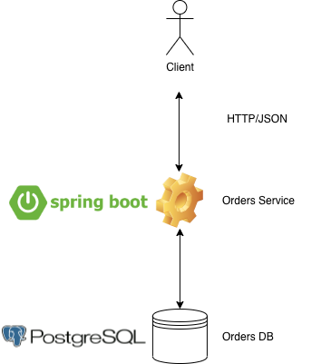

# Customers Microservice



## Prerequisites

Before running the microservice, the following prerequisites must be met:
- Having **Maven** and **Java** (8+) installed 
- **order-postgres** Docker container must be started
- **order-postgres** host name must resolve to **127.0.0.1** (modify `/etc/hosts` file accordingly), for example:

```
$ cat /etc/hosts | grep 127.0.0.1
127.0.0.1       localhost order-postgres
```

## Run microservice

```console
$ mvn exec:exec
```