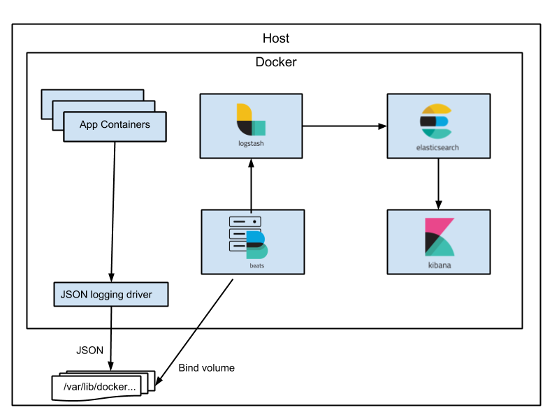

# Logging and tracing

## Prerequisites

- Your Docker host must be configured to use 8Gb of RAM

## Start the logging infrastructure (ELK)



```console
$ docker-compose up -d 
Starting elasticsearch ... done
Starting kibana        ... done
Starting logstash      ... done
Starting filebeat      ... done
```

## Display logs

Point your browser to **http://\<YOUR_DOCKER_HOST\>:5601**, for example [http://localhost:5601](http://localhost:5601/)

User: elastic

Pass: changeme

An "Index pattern" of type "logstash*" must be created before seeing the logs using Kibana.