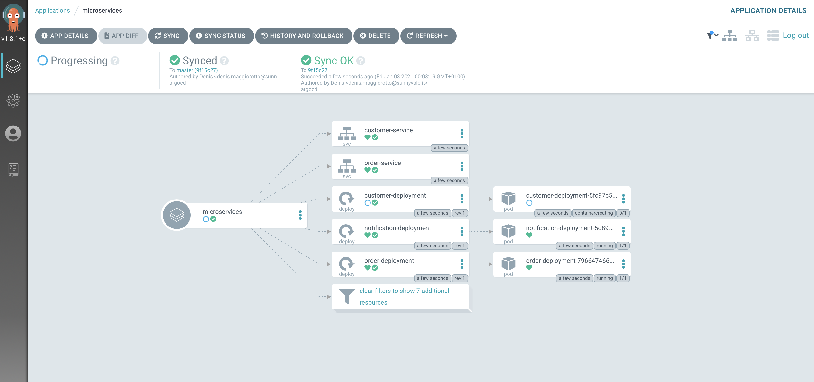
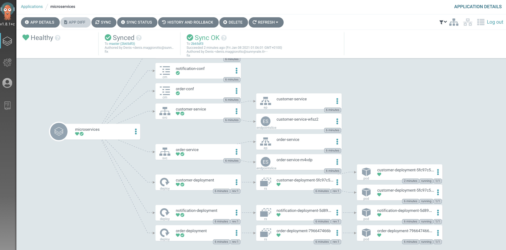

# Microservices continuous integration and delivery

## Prerequisites

Before running this lab you should have on your Kubernetes cluster all the infrastructure components up and running (see [06 - Install infrastructure components on K8S](labs/06-Install_infrastructure_components_on_K8S/README.md).

Also, since now we will use ArgoCD to deploy your microservices on Kubernetes, make sure that no microservices is still running from the previous lab by typing:

```console
$ kubectl delete cm,deploy,svc -l app=notification,order,customer
```

The ArgoCD CLI must be installed (more at https://argoproj.github.io/argo-cd/cli_installation/).


## Automatically build microservices source code, create Docker images and push them on DockerHUB

Have a look of [.github/workflows/build-docker-images.yaml](../../.github/workflows/build-docker-images.yaml) to find out how CI/CD has been implemented to automatically build microservices source code, create Docker images and push them on DockerHUB.

## Automatically deploy microservices on Kubernetess

### Install ArgoCD on Kubernetes

Create the ArgoCD dedicated namespace

```console
$ kubectl create ns argocd
Namespace "argocd" created
```

```console
$ kubectl apply -n argocd -f https://raw.githubusercontent.com/argoproj/argo-cd/stable/manifests/install.yaml
```

The previous command has a very long output, to check if the installation has finished, please type:

```console
$ kubectl get all -n argocd
NAME                                                  READY   STATUS    RESTARTS   AGE
pod/argocd-application-controller-75b4dcd7bb-tlpdx    1/1     Running   122        2d21h
pod/argocd-dex-server-996685b6d-8hlzq                 1/1     Running   2          2d21h
pod/argocd-notifications-controller-87fb87c8c-zk8ts   1/1     Running   1          40h
pod/argocd-redis-99fb49846-ql876                      1/1     Running   2          2d21h
pod/argocd-repo-server-5c76bd686b-hs6zs               1/1     Running   2          2d21h
pod/argocd-server-67885bdcff-zmtvx                    1/1     Running   2          2d21h

NAME                            TYPE        CLUSTER-IP      EXTERNAL-IP   PORT(S)                      AGE
service/argocd-dex-server       ClusterIP   10.99.229.123   <none>        5556/TCP,5557/TCP,5558/TCP   2d21h
service/argocd-metrics          ClusterIP   10.107.38.62    <none>        8082/TCP                     2d21h
service/argocd-redis            ClusterIP   10.106.11.136   <none>        6379/TCP                     2d21h
service/argocd-repo-server      ClusterIP   10.105.18.118   <none>        8081/TCP,8084/TCP            2d21h
service/argocd-server           ClusterIP   10.98.116.184   <none>        80/TCP,443/TCP               2d21h
service/argocd-server-metrics   ClusterIP   10.103.236.98   <none>        8083/TCP                     2d21h

NAME                                              READY   UP-TO-DATE   AVAILABLE   AGE
deployment.apps/argocd-application-controller     1/1     1            1           2d21h
deployment.apps/argocd-dex-server                 1/1     1            1           2d21h
deployment.apps/argocd-notifications-controller   1/1     1            1           40h
deployment.apps/argocd-redis                      1/1     1            1           2d21h
deployment.apps/argocd-repo-server                1/1     1            1           2d21h
deployment.apps/argocd-server                     1/1     1            1           2d21h

NAME                                                        DESIRED   CURRENT   READY   AGE
replicaset.apps/argocd-application-controller-75b4dcd7bb    1         1         1       2d21h
replicaset.apps/argocd-dex-server-996685b6d                 1         1         1       2d21h
replicaset.apps/argocd-notifications-controller-87fb87c8c   1         1         1       40h
replicaset.apps/argocd-redis-99fb49846                      1         1         1       2d21h
replicaset.apps/argocd-repo-server-5c76bd686b               1         1         1       2d21h
replicaset.apps/argocd-server-67885bdcff                    1         1         1       2d21h
```

Make sure that all the Pods are running.

## Test ArgoCD

By default ArgoCD is now published outside the cluster, to reach its user interface you have to create a port forward:

```console
$ kubectl port-forward svc/argocd-server --address 0.0.0.0 -n argocd 4000:443
Forwarding from 127.0.0.1:4000 -> 8080
Forwarding from [::1]:4000 -> 8080
```

Then, using your browser, go to [https://localhost:4000](https://localhost:4000)

The ArgoCD web interface opens:


Login: admin

The password must be taken from the output of this command:

```console
$ kubectl get po -n argocd | grep argocd-server | cut -d " " -f 1
argocd-server-547d9bb879-96t8n
```

To setup your first application on ArgoCD you need to install the argocd CLI (more at https://argoproj.github.io/argo-cd/cli_installation/), then login:

```console
$ argocd login localhost:4000 --insecure --username admin --grpc-web  --password $(kubectl get po -n argocd | grep argocd-server | cut -d " " -f 1)
'admin' logged in successfully
Context 'localhost:4000' updated
```

The previous command assumes that still have the port forward open and you reach ArgoCD using localhost:4000 url.

Create the app (please replace the placeholder \<YOUR GITHUB ACCOUNT\> with your GitHub account):

```console
$ argocd app create microservices \
    --repo https://github.com/<YOUR GITHUB ACCOUNT>/ITS-ICT_Microservices.git \
    --path labs/07-Deploy_microservices_on_K8S \
    --dest-server https://kubernetes.default.svc \
    --dest-namespace default \
    --auto-prune \
    --self-heal \
    --sync-policy auto \
    --sync-option CreateNamespace=true \
    --revision master 
application 'microservices' created
```

The application is now deployed on Kubernetes and ArgoCD web interface displays it:



To modify the running state of your application, just modify one of the manifests contained in [07 - Deploy microservices on K8S](labs/07-Deploy_microservices_on_K8S) and ArgoCD will take car to apply the desired state to the current state.

For example, scale your **customer** microservices to 2 Pods by modifying the manifest as shown below:

```console
$ cat ../07-Deploy_microservices_on_K8S/customer-ms.yaml | grep replicas
  replicas: 2
```
Then commit + push your mldification on GitHub.

If you wait for a minute, you should see that ArgoCD spinned up one more Pod for the customer  microservice:



To remove the application:

```console
$ argocd app delete microservices --cascade
```


