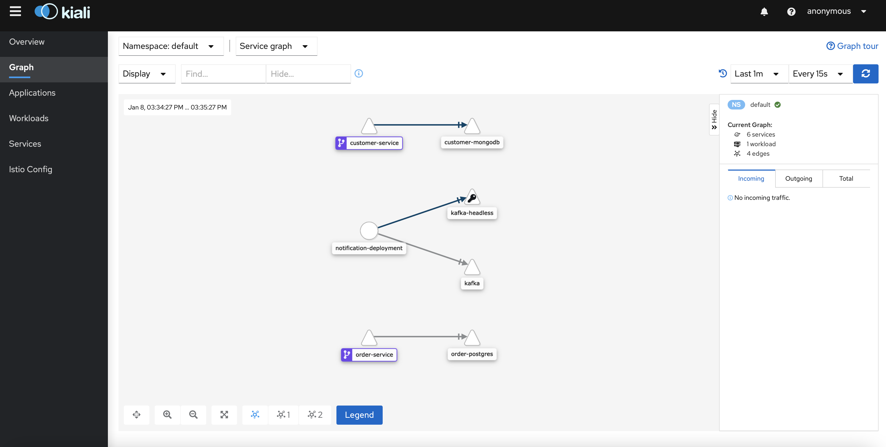

# Service mesh

The term service mesh is used to describe the network of microservices that make up such applications and the interactions between them.

On top of Kubernetes, we will use Istio to get behavioral insights and operational control over the service mesh as a whole.

Istio provides behavioral insights and operational control over the service mesh as a whole, offering a complete solution to satisfy the diverse requirements of microservice applications.

Istio helps developers and operators to address the challenges faced  when  translating a monolithic application in a distributed microservice architecture.

## Prerequisites

- Having a working Minikube environment with kubectl CLI tool pointing to it
- Infrastructure components ([06 - Install infrastructure components on K8S](labs/06-Install_infrastructure_components_on_K8S/README.md)) must be running on Minikube before starting this lab
- Having a bash environment (Linux, Git bash, etc)

## Setup Istio

Download Istio

```console
$ curl -L https://istio.io/downloadIstio | sh -
  % Total    % Received % Xferd  Average Speed   Time    Time     Time  Current
                                 Dload  Upload   Total   Spent    Left  Speed
100   102  100   102    0     0    343      0 --:--:-- --:--:-- --:--:--   343
100  4579  100  4579    0     0  11893      0 --:--:-- --:--:-- --:--:-- 11893

Downloading istio-1.8.1 from https://github.com/istio/istio/releases/download/1.8.1/istio-1.8.1-linux-amd64.tar.gz ...

Istio 1.8.1 Download Complete!

Istio has been successfully downloaded into the istio-1.8.1 folder on your system.

Next Steps:
See https://istio.io/latest/docs/setup/install/ to add Istio to your Kubernetes cluster.

To configure the istioctl client tool for your workstation,
add the /home/developer/ITS-ICT_Microservices/istio-1.8.1/bin directory to your environment path variable with:
         export PATH="$PATH:/home/developer/ITS-ICT_Microservices/labs/09-Service_mesh/istio-1.8.1"

Begin the Istio pre-installation check by running:
         istioctl x precheck 

Need more information? Visit https://istio.io/latest/docs/setup/install/ 
```

Now enter in the Istio folder

```console
$ cd istio-*
```

Prepend the current working dir to the PATH env. variable

```console
$ export PATH=$PWD/bin:$PATH
$ cd ..
```

Install Istio


```console
$ istioctl install --set profile=demo -y
✔ Istio core installed
✔ Istiod installed
✔ Egress gateways installed                                                                   
✔ Ingress gateways installed
✔ Installation complete  
```

## Use Istio with your microservices

Add a namespace label to instruct Istio to automatically inject Envoy sidecar proxies when you deploy your application later:   

```console
$ kubectl label namespace default istio-injection=enabled
namespace/default labeled
```

Now deploy microservices

```console
$ kubectl apply -f ../07-Deploy_microservices_on_K8S/
deployment.apps/customer-deployment created
service/customer-service created
configmap/customer-conf created
deployment.apps/notification-deployment created
configmap/notification-conf created
deployment.apps/order-deployment created
service/order-service created
configmap/order-conf created
```

The application will start. As each pod becomes ready, the Istio sidecar will be deployed along with it.


```console
$ kubectl get svc,pod
NAME                               TYPE        CLUSTER-IP       EXTERNAL-IP   PORT(S)                      AGE
service/customer-mongodb           ClusterIP   10.96.74.113     <none>        27017/TCP                    13h
service/customer-service           NodePort    10.105.141.122   <none>        8102:32102/TCP               111s
service/kafka                      ClusterIP   10.102.130.222   <none>        9092/TCP                     13h
service/kafka-headless             ClusterIP   None             <none>        9092/TCP,9093/TCP            13h
service/kafka-zookeeper            ClusterIP   10.101.16.213    <none>        2181/TCP,2888/TCP,3888/TCP   13h
service/kafka-zookeeper-headless   ClusterIP   None             <none>        2181/TCP,2888/TCP,3888/TCP   13h
service/kubernetes                 ClusterIP   10.96.0.1        <none>        443/TCP                      4d18h
service/order-postgres             ClusterIP   10.100.223.142   <none>        5432/TCP                     12h
service/order-postgres-headless    ClusterIP   None             <none>        5432/TCP                     12h
service/order-service              NodePort    10.106.253.66    <none>        8103:32103/TCP               111s

NAME                                           READY   STATUS    RESTARTS   AGE
pod/customer-deployment-5fc97c5659-v4kj4       2/2     Running   0          111s
pod/customer-mongodb-66f78bcc7f-ps9l7          1/1     Running   1          13h
pod/kafka-0                                    1/1     Running   4          13h
pod/kafka-zookeeper-0                          1/1     Running   1          13h
pod/notification-deployment-5d898f54c5-92289   2/2     Running   0          111s
pod/order-deployment-796647466b-chs8h          2/2     Running   0          110s
pod/order-postgres-0                           1/1     Running   1          12h
```

Notice that each microservices has now two containers in it (READY 2/2).

Test the customer microservice

```console
$ kubectl exec "$(kubectl get pod -l app=customer -o jsonpath='{.items[0].metadata.name}')" -c customer-ms -- wget -qO- localhost:8102/customers-service/v2/customers
[]
```

Test the order microservice

```console
$ kubectl exec "$(kubectl get pod -l app=order -o jsonpath='{.items[0].metadata.name}')" -c order-ms -- wget -qO- localhost:8103/orders-service/v2/orders
[]
```

Apply the Istio resources

```console
$ kubectl apply -f microservices-istio.yaml 
gateway.networking.istio.io/microservices-gateway created
virtualservice.networking.istio.io/microservices created
```

Ensure that there are no issues with the configuration:

```console
$ istioctl analyze
Warning [IST0103] (Pod customer-mongodb-66f78bcc7f-ps9l7.default) The pod is missing the Istio proxy. This can often be resolved by restarting or redeploying the workload.
Warning [IST0103] (Pod kafka-0.default) The pod is missing the Istio proxy. This can often be resolved by restarting or redeploying the workload.
Warning [IST0103] (Pod kafka-zookeeper-0.default) The pod is missing the Istio proxy. This can often be resolved by restarting or redeploying the workload.
Warning [IST0103] (Pod order-postgres-0.default) The pod is missing the Istio proxy. This can often be resolved by restarting or redeploying the workload.
Info [IST0118] (Service kafka-zookeeper-headless.default) Port name follower (port: 2888, targetPort: follower) doesn't follow the naming convention of Istio port.
Info [IST0118] (Service kafka-zookeeper.default) Port name follower (port: 2888, targetPort: follower) doesn't follow the naming convention of Istio port.
```

We can forget about the warnings (if any).

## Call microservices through Istio


Discover the Istio NodePort port (in this case 30333)

```console
$ kubectl -n istio-system get service istio-ingressgateway -o jsonpath='{.spec.ports[?(@.name=="http2")].nodePort}'
30033
```

Discover the Minikube ip (in this case 192.168.39.77)

```console
$ minikube ip
192.168.39.77
```

We are now able to call our microservice through Istio

```console
$ curl -vvv http://192.168.39.77:30033/orders-service/v2/orders
* Expire in 0 ms for 6 (transfer 0x559fba513f90)
*   Trying 192.168.39.77...
* TCP_NODELAY set
* Expire in 200 ms for 4 (transfer 0x559fba513f90)
* Connected to 192.168.39.77 (192.168.39.77) port 30033 (#0)
> GET /orders-service/v2/orders HTTP/1.1
> Host: 192.168.39.77:30033
> User-Agent: curl/7.64.0
> Accept: */*
> 
< HTTP/1.1 200 OK
< content-type: application/json;charset=UTF-8
< date: Fri, 08 Jan 2021 14:00:19 GMT
< x-envoy-upstream-service-time: 17
< server: istio-envoy
< transfer-encoding: chunked
< 
* Connection #0 to host 192.168.39.77 left intact
[]
```

```console
$ curl -vvv http://192.168.39.77:30033/customers-service/v2/customers
* Expire in 0 ms for 6 (transfer 0x55a77de19f90)
*   Trying 192.168.39.77...
* TCP_NODELAY set
* Expire in 200 ms for 4 (transfer 0x55a77de19f90)
* Connected to 192.168.39.77 (192.168.39.77) port 30033 (#0)
> GET /customers-service/v2/customers HTTP/1.1
> Host: 192.168.39.77:30033
> User-Agent: curl/7.64.0
> Accept: */*
> 
< HTTP/1.1 200 OK
< content-type: application/json;charset=UTF-8
< date: Fri, 08 Jan 2021 14:01:20 GMT
< x-envoy-upstream-service-time: 47
< server: istio-envoy
< transfer-encoding: chunked
< 
* Connection #0 to host 192.168.39.77 left intact
[]
```

The empty arrays `[]` mean that the services are available and return no records.

## Install **Kiali**, the Istio UI

```console
$ kubectl apply -f istio-1.8.1/samples/addons/
...
```


Wait a few minutes and start a port forward 

```console
$ kubectl port-forward svc/kiali --address 0.0.0.0 -n istio-system 20001:20001
Forwarding from 0.0.0.0:20001 -> 20001
```


Open your browser on http://localhost:20001/kiali

 

You can see the microservices architecture topology.