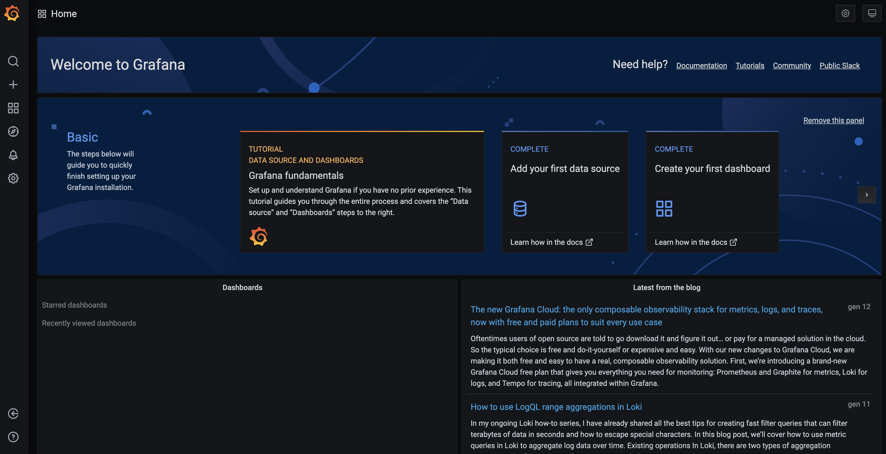
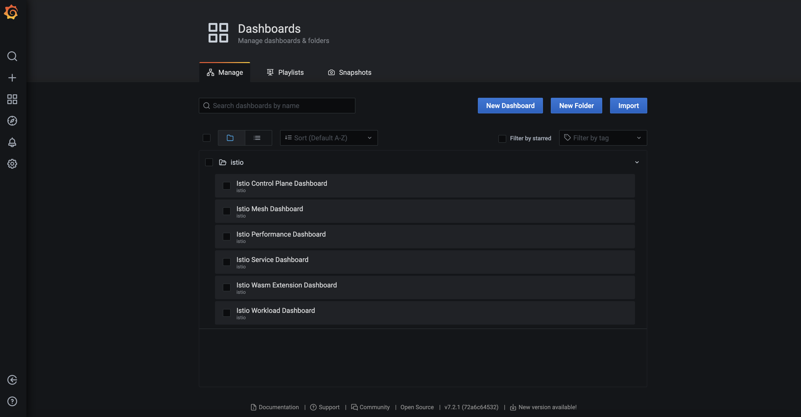
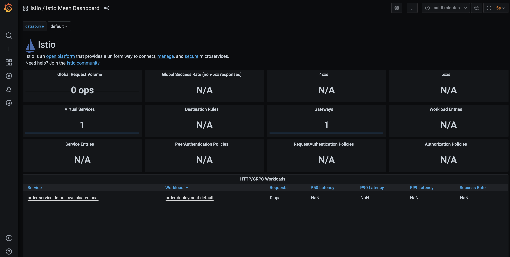
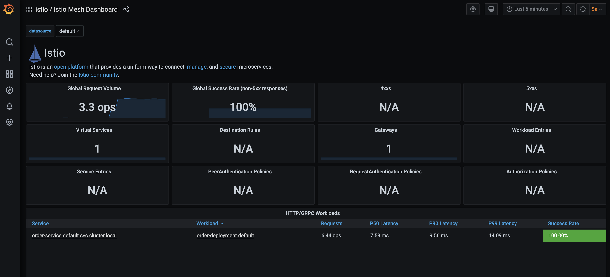
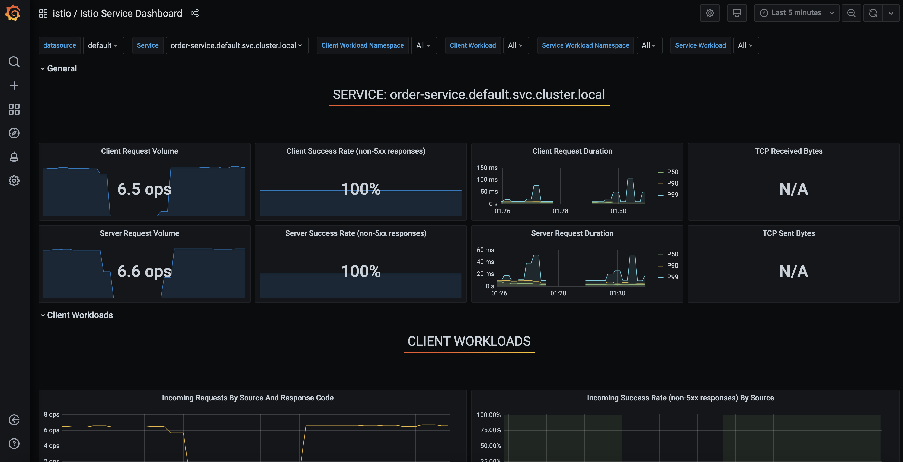

# Microservices monitoring

## Prerequisites

- Having completed lab [09 - Service mesh](labs/09-Service_mesh/README.md)

## Monitor microservices

Verify that the prometheus service is running in your cluster.
In Kubernetes environments, execute the following command:

```console
$ kubectl -n istio-system get svc prometheus
NAME         TYPE        CLUSTER-IP       EXTERNAL-IP   PORT(S)    AGE
prometheus   ClusterIP   10.110.142.167   <none>        9090/TCP   2m54s
```

Verify that the Grafana service is running in your cluster.
In Kubernetes environments, execute the following command:

```console
$ kubectl -n istio-system get svc grafana
NAME      TYPE        CLUSTER-IP      EXTERNAL-IP   PORT(S)    AGE
grafana   ClusterIP   10.105.136.16   <none>        3000/TCP   3m54s
```

Run the port forward to access to Grafana

```console
$ kubectl port-forward svc/grafana --address 0.0.0.0 -n istio-system 3000:3000
Forwarding from 0.0.0.0:3000 -> 3000
```

Now, open your browser to http://localhost:3000 (use localhost if you are running Minikube on you PC, instead you may need to substitute localhost with one of the Kubernetes' node ip address)

The Grafana home page opens:



Istio (lab ) offers many Grafana dashboards to monitor your microservices:



Open the **Istio Mesh Dashboard**



And forward traffic to your microservices (host and port of Istio gateway are the ones discovered during the lab [09 - Service mesh](labs/09-Service_mesh/README.md)):

```console
$ for i in $(seq 1 1000); do curl -s -o /dev/null "http://192.168.39.77:30033/orders-service/v2/orders"; done
```

Watching Grafana, you may notice that the traffic is being monitored in **Istio Mesh Dashboard**



Now open the **Istio Service Dashboard**

If you keep the curl loop running, you should see that all the fraffic thoward the **order-service** is monitored as well


 
